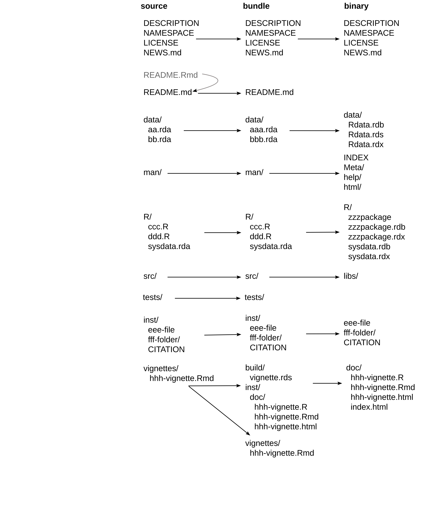
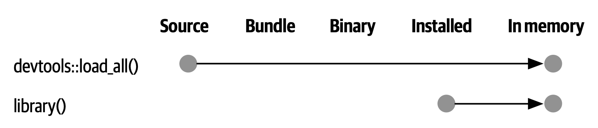
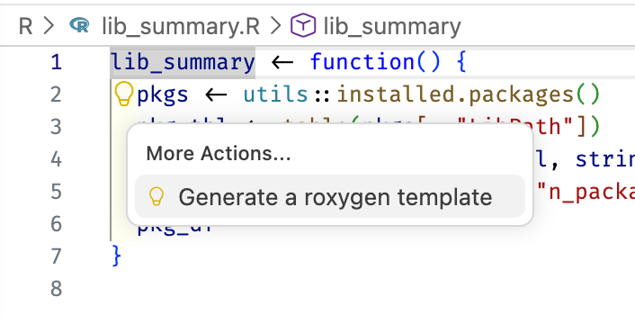
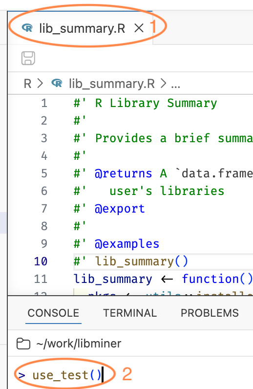
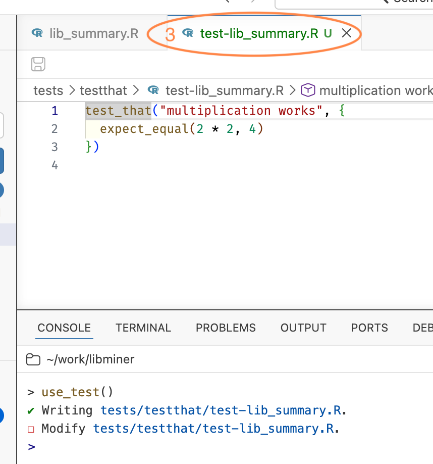
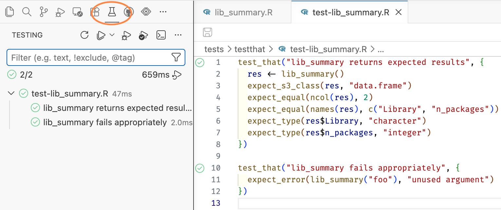
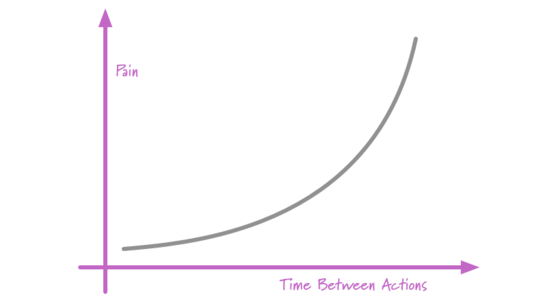
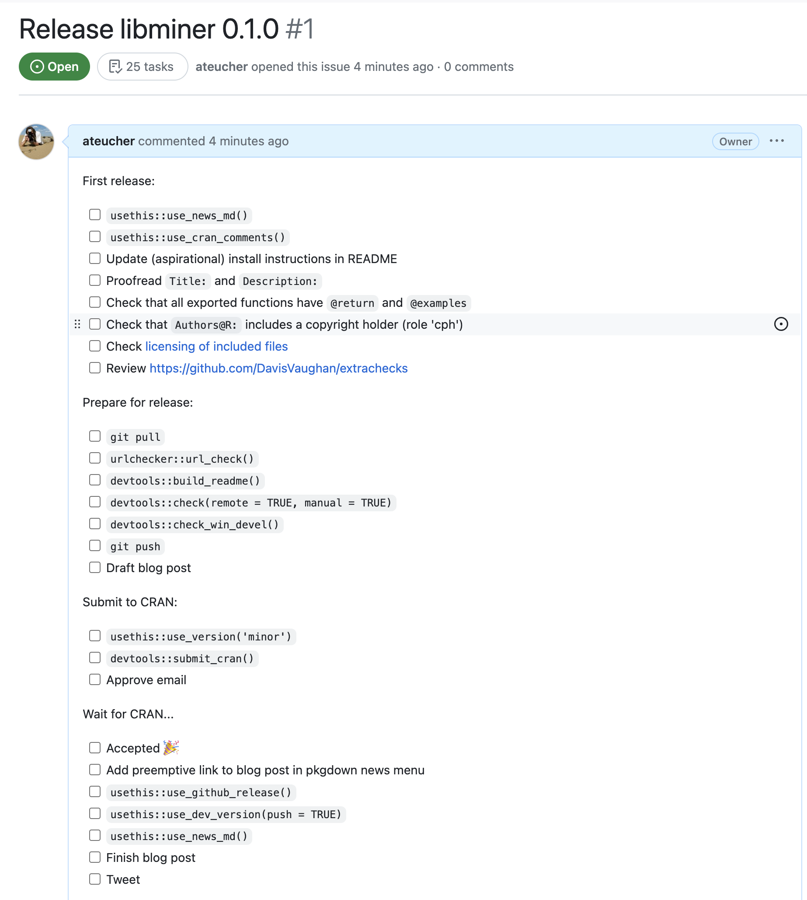

# Setup

## How to follow along

* These slides are available on the workshop website.
* Workshop website also has one page per module:
  - Use this to copy / paste content
  - See exact devtools/usethis functions
* Questions, links, and getting unstuck: the
  [#pkg-dev](https://raukr.slack.com/archives/C090ZD4GWD9) channel in the
  RaukR Slack
* Deeper reading: [R Packages (2e)](https://r-pkgs.org),
  especially [The Whole Game](https://r-pkgs.org/whole-game.html)

## Tools

<!-- TODO: Air, the R formatter. My posit::conf(2025) pkg-dev deck covers it,
     this one does not. Probably fine to leave out: Air comes up in the Positron
     session on Aug 10, two days before this one, so it would be a repeat.
     Decide whether it deserves a mention here anyway, e.g. use_air() as part of
     package setup. -->

* R, ideally the current release
* [Positron](https://positron.posit.co/download.html)
* A package development toolchain (Rtools, Xcode CLI tools, `r-base-dev`)
* The devtools package

Git and GitHub are optional but strongly recommended.

## Installing R

I recommend [rig](https://github.com/r-lib/rig), the R Installation Manager:

```
rig add release
```

It handles the fiddly parts, steers you into best practices, and lets you
keep several versions of R side by side.

## Installing packages

```r
install.packages("devtools")
```

devtools is a meta-package, so usethis, roxygen2, testthat, and pkgdown all
come along.

I personally use [pak](https://pak.r-lib.org) for all package management:

```r
pak::pak("devtools")
```

## Situation reports

Is my system ready to develop packages?

```r
devtools::dev_sitrep()
```

Do R, Git, and GitHub understand each other?

```r
usethis::git_sitrep()
```

You want a name, an email, and a PAT reported as `<discovered>`.

## Why Positron?

Everything here works in RStudio too. The commands are all devtools and
usethis calls, which are IDE-agnostic.

But we will lean on Positron's package development affordances, which live
in the Command Palette and behind keyboard shortcuts.

# Overview

## Why make a package?

* Easier to reuse the functions you write
* A consistent framework that nudges you to organize, document, and test
* That framework unlocks a lot of standardized tooling
* The easiest way to distribute code, to your team or to the world

## Let's make a package together

We will:

* Create a small package from scratch
* Use Git to track our changes
* Push the code to GitHub
* Write documentation
* Write tests
* Take on a dependency
* Set up automated checks and a website

## We won't

* Talk much about writing and designing functions
* Talk about shipping data in your package (possible, and often useful)
* Go deep on any one topic

Half a day is enough for the whole game, once. Depth comes later.

## Our end goal

**libminer**, a toy package that tells you about your R libraries.

* Jenny's libminer from 2025:
  <https://github.com/jennybc/libminer-raukr-2025>
* Jenny's libminer from 2026: PLACEHOLDER, we make it live today

## Five forms of a package

{width="90%"
fig-alt="Diagram from R Packages showing the five states of a package (source,
bundle, binary, installed, in memory) and which function moves a package between
them."}

## A package in "source" form

<!-- TODO: still open, do we need this slide at all? -->

{width="42%"
fig-alt="Diagram from R Packages showing which files appear in a package in
source, bundle, and binary form."}

# Create a package

## Libraries: where packages live

* A library is a directory containing installed packages
* You have at least one, and commonly two:
  1. a system library, with the base and recommended packages
  2. a user library, with everything you installed
* `library(pkg)` attaches a package from a library

## Where do your packages live?

```r
.libPaths()
```

```r
installed.packages()[, c("Package", "Version", "LibPath")]
```

That is the raw material for the package we are about to build.

## Load devtools

```r
library(devtools)
```

* Attaches usethis as well, which is the source of most functions we will use
* Update it if it is old

## `create_package()`

```r
create_package("~/work/libminer")
```

Pick a location that makes sense to you. Not inside another package or
Git repo!

## What you get

```
libminer
├── .Rbuildignore
├── DESCRIPTION
├── NAMESPACE
├── R
└── libminer.Rproj
```

* A directory with the basic package skeleton
* Opened as a new project in Positron

## `use_git()`

```r
use_git()
```

* Turns the package directory into a Git repository
* Offers to commit the files
* Offers to restart

## `use_github()`

```r
use_github()
```

Creates a GitHub repo and pushes your package to it.

Prerequisites: a GitHub account, and credentials that work. That is what
`git_sitrep()` was for.

## `use_devtools()`

```r
use_devtools()
```

Adds a line to your `.Rprofile` so devtools is attached in every interactive
session. Paste, save, restart R.

Skip it if you prefer, then just call `library(devtools)` after each restart.

## Your turn

* Create your package with `create_package()`
* Poke around the files it made
* Run `use_git()`, then `use_github()`
* Run `use_devtools()` and restart R

## `use_r()`

```r
use_r("lib_summary")
```

* Your R code goes in `R/`
* Name the file after the function it defines
* Put the function definition, and only the definition, in the file

## Write your first function

```r
lib_summary <- function() {
  pkgs <- utils::installed.packages()
  pkg_tbl <- table(pkgs[, "LibPath"])
  pkg_df <- as.data.frame(pkg_tbl, stringsAsFactors = FALSE)
  names(pkg_df) <- c("Library", "n_packages")
  pkg_df
}
```

## How do you test drive it?

Tempting, but no:

* ~~`source("R/lib_summary.R")`~~
* ~~Send the function definition to R console with keyboard shortcut~~

Do this instead:

```r
load_all() # remember: I assume devtools is attached!
```

## `load_all()`

{width="90%"
fig-alt="Diagram from R Packages contrasting devtools::load_all(), which takes a
package from source straight into memory, with library(), which loads an already
installed package."}

Simulates building, installing, and attaching your package.

* Makes all your package's functions available immediately
* Fast iteration: edit, load, run
* A good approximation of how users will meet your package

## {background-image="images/workflow-1-code.png" background-size="contain"}

## Workflow: edit, load, run

`load_all()` is the single most common thing you do.

* **R: Load R Package** in the Command Palette
* <kbd>Cmd/Ctrl</kbd> + <kbd>Shift</kbd> + <kbd>L</kbd>

Worth committing to muscle memory.

## Your turn

* `use_r("lib_summary")`
* Write `lib_summary()` in that file
* `load_all()`, then call `lib_summary()`
* Commit your changes

## `check()`

Runs `R CMD check`, the official checker, from within R.

* **R: Check R Package** in the Command Palette
* <kbd>Cmd/Ctrl</kbd> + <kbd>Shift</kbd> + <kbd>E</kbd>
* or `check()` in the console (the command / keyboard shortcut is better, tho)

Check early, check often. "If it hurts, do it more often."

## {background-image="images/workflow-2-code-check.png" background-size="contain"}

## Three kinds of message

* **ERROR**: severe problems, always fix
* **WARNING**: fix them, and you must fix them for CRAN
* **NOTE**: mild problems, or sometimes just an observation

For CRAN, try to get to zero of all three.

## The `DESCRIPTION` file

Your package's metadata. Edit along these lines:

```
Package: libminer
Title: Explore Your R Libraries
Version: 0.0.0.9000
Authors@R:
    person("Jane", "Doe",
           email = "jane.doe@something.com",
           role = c("aut", "cre"),
           comment = c(ORCID = "XXXX-XXXX-XXXX-XXXX"))
Description: Provides functions for learning about your R libraries, and the
    packages you have installed.
```

## `DESCRIPTION` details

* Every package must have one. It is the defining feature
* Machine readable, with fussy formatting (Debian Control Format)
* `Title`: one line, title case, no full stop
* `Description`: full sentences, ends with a full stop, does not start with
  "A package for"
* `Authors@R` is unusual: it holds executable R code

## Licenses

`use_*_license()`

* Permissive: MIT (simple), Apache 2.0 (MIT plus patent protection)
* Copyleft: GPL, AGPL, LGPL. Improvements must be shared
* Creative Commons: good for data packages. CC0, CC-BY

## `use_mit_license()`

```r
use_mit_license()
```

```
✔ Adding 'MIT + file LICENSE' to License
✔ Writing 'LICENSE'
✔ Writing 'LICENSE.md'
✔ Adding '^LICENSE\.md$' to '.Rbuildignore'
```

Then check again.

## Your turn

* `check()` and read the output
* Fill in `DESCRIPTION` with your own details
* `use_mit_license()`
* `check()` again, then commit and push

# Documentation

## `man/*.Rd`

Help files live in `man/` and are written in an Rd markup language.

You will not write them by hand. You write roxygen comments next to your
code, and roxygen2 generates the `.Rd` files.

## roxygen2

Special comments starting with `#'` above a function definition:

* Title and description
* `@param` for each argument
* `@returns` for the return value
* `@export` to make it public
* `@examples` for usage

Documentation lives with the code.

## Generating a skeleton in Positron

* Put your cursor in the function's name
* A light bulb appears, offering "Show Code Actions"
* Choose **Generate a roxygen template**

{width="55%"
fig-alt="The Positron editor with the cursor in the function name lib_summary. A
light bulb has appeared and its menu is open, showing the code action \"Generate
a roxygen template\"."}

## A roxygen block

```r
#' R Library Summary
#'
#' Provides a brief summary of the package libraries on your machine
#'
#' @returns A `data.frame` containing the count of packages in each of the
#'   user's libraries
#' @export
#'
#' @examples
#' lib_summary()
lib_summary <- function() {
  ...
}
```

## `document()`

Turns roxygen comments into `man/*.Rd` and updates `NAMESPACE`.

* **R: Document R Package** in the Command Palette
* <kbd>Cmd/Ctrl</kbd> + <kbd>Shift</kbd> + <kbd>D</kbd>
* or `document()` in the console (the command / keyboard shortcut is better, tho)

Then preview:

```r
load_all()

?lib_summary
```

## `NAMESPACE`

Lists the R objects that are:

* **Exported** from your package for users: `export()`, `S3method()`
* **Imported** from other packages for your internal use: `import()`,
  `importFrom()`

`document()` maintains this file for you. Do not edit it by hand.

## {background-image="images/workflow-3-doc.png" background-size="contain"}

## {background-image="images/workflow-4-code-doc-check.png" background-size="contain"}

## Documentation workflow

Edit roxygen, `document()`, `?fun`, repeat.

Add it to the loop you already have:

* `load_all()`, <kbd>Cmd/Ctrl</kbd> + <kbd>Shift</kbd> + <kbd>L</kbd>
* `document()`, <kbd>Cmd/Ctrl</kbd> + <kbd>Shift</kbd> + <kbd>D</kbd>
* `check()`, <kbd>Cmd/Ctrl</kbd> + <kbd>Shift</kbd> + <kbd>E</kbd>

## Package-level documentation

```r
use_package_doc()

document()
```

```r
?libminer
```

A landing page for the package as a whole. Then check again.

## `install()`

Installs your package into your library, for real.

* **R: Install R Package and Restart R** in the Command Palette
* <kbd>Cmd/Ctrl</kbd> + <kbd>Shift</kbd> + <kbd>B</kbd>

```r
library(libminer)

lib_summary() # one more package than before, that's yours!
```

## README

```r
use_readme_rmd()
```

Your package's home page on GitHub. Cover:

* The purpose of the package
* Installation instructions
* Example usage

## Installation instructions

```r
# install.packages("pak")
pak::pak("jennybc/libminer")
```

Then render `README.Rmd` to `README.md`:

```r
build_readme()
```

`build_readme()` renders against the current source of your package.

## Your turn

* Add a roxygen block, `document()`, and read your own help page
* `use_package_doc()` and `document()` again
* `install()` and use your package like a user would
* `use_readme_rmd()`, fill it in, `build_readme()`
* Check, commit, push

# Tests

## Why formal tests?

You are already testing informally, every time you `load_all()` and try
something out.

Formal tests make that permanent: they run every time, in a fresh session,
on every platform.

## Benefits of automated tests

* Fewer bugs. Informal testing explores typical usage; formal tests
  anticipate the weird cases
* Better code structure. Hard-to-test code is usually badly factored code
* A call to action. Write a failing test first when you hit a bug
* Robust code. You can refactor with confidence

## `use_testthat()`

```r
use_testthat()
```

* Adds testthat to `Suggests`
* Creates `tests/testthat/`
* Writes `tests/testthat.R`

You still have to write the tests.

## `use_test()`

```r
use_test("lib_summary")
```

Better: with `R/lib_summary.R` open in the editor, call `use_test()` with no
arguments. usethis creates and opens the companion test file.

::: {layout="[[2,3]]"}
{fig-alt="The Positron editor with R/lib_summary.R open and its tab circled, and the R console below where use_test() has been typed but not yet run."}

{fig-alt="The Positron editor now showing a second tab, test-lib_summary.R, circled, containing testthat's placeholder \"multiplication works\" test. The console reports writing tests/testthat/test-lib_summary.R."}
:::

`use_r()` is the inverse, for jumping back the other way.

## Anatomy of a test

* **File**: one or more related tests, named `test-*.R`, mirroring `R/`
* **Test**: `test_that("description", { ... })`, one unit of functionality
* **Expectation**: `expect_*()`, one specific comparison

Failure reports quote the description, so make it informative.

## Write a test

```r
test_that("lib_summary returns expected results", {
  res <- lib_summary()
  expect_s3_class(res, "data.frame")
  expect_equal(ncol(res), 2)
  expect_equal(names(res), c("Library", "n_packages"))
  expect_type(res$Library, "character")
  expect_type(res$n_packages, "integer")
})
```

## Run your tests

* **R: Test R Package in Test Explorer** in the Command Palette
* <kbd>Cmd/Ctrl</kbd> + <kbd>Shift</kbd> + <kbd>T</kbd>
* or `test()` in the console

## Positron's Test Explorer

A tree of your test files and `test_that()` blocks, with pass and fail marks
on each one.

* Run or re-run a single test
* Very handy when you are chasing one failure

{width="55%"
fig-alt="Positron's Testing pane, reached via the circled flask icon in the
activity bar. A summary line reads 2/2 in 659ms, above a tree with
test-lib_summary.R and its two tests, each with a green check."}

**R: Test R Package in Terminal** gives you plain console output instead.

## {background-image="images/workflow-5-test.png" background-size="contain"}

## {background-image="images/workflow-6-code-test.png" background-size="contain"}

## {background-image="images/workflow-7-code-test-doc.png" background-size="contain"}

## {background-image="images/workflow-8-all-check.png" background-size="contain"}

## Workflow: code plus tests

* Edit code, `load_all()`, <kbd>Cmd/Ctrl</kbd> + <kbd>Shift</kbd> + <kbd>L</kbd>
* Edit tests, `test()`, <kbd>Cmd/Ctrl</kbd> + <kbd>Shift</kbd> + <kbd>T</kbd>
* Edit roxygen, `document()`, <kbd>Cmd/Ctrl</kbd> + <kbd>Shift</kbd> + <kbd>D</kbd>
* Periodically, `check()`, <kbd>Cmd/Ctrl</kbd> + <kbd>Shift</kbd> + <kbd>E</kbd>

## Your turn

* `use_testthat()`
* `use_test()` with `R/lib_summary.R` open
* Write a couple of tests and run them
* `check()`, commit, push

# Dependencies

## Taking on a dependency

Let's report the on-disk size of each library, using the fs package.

```r
use_package("fs")
```

* Every package you use must be declared
* Never call `library()` in code below `R/`

## Depends, Imports, Suggests

* **Depends**: installed with your package *and* attached. Rarely what you want
* **Imports**: installed with your package. The usual choice
* **Suggests**: not installed automatically. For development, tests,
  vignettes, or rarely used features

## `Imports` in two files

* Listing a package in `Imports:` in `DESCRIPTION` does not "import" it
* A package in `Imports:` may, but need not, appear in `NAMESPACE`
* Every package in `NAMESPACE` must be in `Imports:` (or `Depends:`)

## Three ways to call another package's functions

1. `pkg::fun()`, always fine, always explicit
2. `#' @importFrom pkg fun1 fun2`, for functions you use constantly
3. `#' @import pkg`, the whole package. Rarely a good idea

We will use `pkg::fun()`.

## Use the dependency

```r
lib_summary <- function(sizes = FALSE) {
  pkgs <- utils::installed.packages()
  pkg_tbl <- table(pkgs[, "LibPath"])
  pkg_df <- as.data.frame(pkg_tbl, stringsAsFactors = FALSE)
  names(pkg_df) <- c("Library", "n_packages")

  if (sizes) {
    pkg_df$lib_size <- fs::as_fs_bytes(vapply(
      pkg_df$Library,
      function(x) {
        sum(fs::dir_info(x, recurse = TRUE, type = "file")$size)
      },
      FUN.VALUE = numeric(1)
    ))
  }
  pkg_df
}
```

## Manual test drive

```r
load_all()
lib_summary()
lib_summary(TRUE)
```

Seems to work!

## But the tests disagree

Run the tests and one of them fails. This is the system working as designed.

Update the test, and add one for the new behaviour:

```r
test_that("sizes argument works", {
  res <- lib_summary(sizes = TRUE)
  expect_equal(names(res), c("Library", "n_packages", "lib_size"))
  expect_type(res$lib_size, "double")
})
```

## And `check()` disagrees too

A warning about an undocumented parameter, `sizes`.

```r
#' @param sizes Should the sizes of the libraries be calculated?
#'
#' @returns A data.frame containing the count of packages in each of the
#'   user's libraries. A `lib_size` column is included if `sizes = TRUE`.
```

Then `document()` and check again.

## Clean

```
0 errors ✔ | 0 warnings ✔ | 0 notes ✔
```

## Your turn

* `use_package("fs")`
* Add the `sizes` argument
* Fix and extend your tests
* Document `sizes`, `document()`, `check()`
* Commit and push

# Continuous integration

## `use_github_action()`

If your code is on GitHub, GitHub Actions can check your package on three
operating systems every time you push.

```r
use_github_action()
```

Choose `check-standard`.

## What it writes

* `.github/workflows/R-CMD-check.yaml`
* An R-CMD-check badge in `README.Rmd`

So re-render the README:

```r
build_readme()
```

## Commit and push

The config has to be on GitHub to take effect.

```r
browse_github()
browse_github_actions()
```

Admire the badge, and your automatic multi-platform check results.

## Your turn

* `use_github_action()`
* `build_readme()`
* `check()`, commit, push
* Watch the checks run on GitHub

# A package website

## `use_pkgdown_github_pages()` {.smaller}

```r
use_pkgdown_github_pages()
```

Commit and push.

That is all you need to publish a beautiful website for your package.

Assuming that:

* You are using Git
* and GitHub
* and Git and GitHub work smoothly from R
* and the repo is public
* and you remembered to commit and push afterwards

## Your turn

* `use_pkgdown_github_pages()`
* Commit and push
* Visit the URL in the output and marvel at your handiwork

# Release

## Getting your package to users

* **GitHub**: easy for you, harder for users. Comes free with everything we
  just did. Good for a small, savvy audience
* **CRAN**: easy for users, harder for you. Binaries, discoverability,
  ordinary `install.packages()`, and stringent requirements

## Preparing for CRAN

"If it hurts, do it more often."

{width="45%"
fig-alt="A curve rising steeply: pain on the vertical axis, time between actions
on the horizontal axis."}

* `check()` often, aiming for zero errors, warnings, and notes
* Let GitHub Actions check you on every platform, on every push

## `use_release_issue()`

```r
use_release_issue()
```

Opens a GitHub issue with a checklist for preparing a CRAN release.

{width="42%"
fig-alt="A GitHub issue titled Release libminer 0.1.0 with 25 task checkboxes,
grouped into First release, Prepare for release, Submit to CRAN, and Wait for
CRAN."}

# Review

## {background-image="images/workflow-9-all-git.png" background-size="contain"}

## Review: functions

**Run once**

`create_package()`, `use_git()`, `use_github()`, `use_devtools()`,
`use_mit_license()`, `use_testthat()`, `use_readme_rmd()`,
`use_package_doc()`, `use_github_action()`, `use_pkgdown_github_pages()`,
`use_release_issue()`

**Run periodically**

`use_r()`, `use_test()`, `use_package()`, `build_readme()`, `install()`

## Review: shortcuts {.smaller}

| Function | Positron command | Shortcut |
|---|---|---|
| `load_all()` | R: Load R Package | Cmd/Ctrl + Shift + L |
| `document()` | R: Document R Package | Cmd/Ctrl + Shift + D |
| `test()` | R: Test R Package in Test Explorer | Cmd/Ctrl + Shift + T |
| `check()` | R: Check R Package | Cmd/Ctrl + Shift + E |
| `install()` | R: Install R Package and Restart R | Cmd/Ctrl + Shift + B |

## Resources

* [r-pkgs.org](https://r-pkgs.org), the book behind this workshop
* [happygitwithr.com](https://happygitwithr.com), for Git and GitHub trouble
* [design.tidyverse.org](https://design.tidyverse.org), for function design
* [Posit cheatsheets](https://posit.co/resources/cheatsheets/)

## Thanks!

Workshop site:
<https://jennybc.github.io/2026_raukr-positron-ai-pkg-dev/>

Read next: [R Packages (2e)](https://r-pkgs.org)

Gratefully adapted from materials by
[Andy Teucher](https://github.com/ateucher) for
[Introduction to R Package Development](https://posit-conf-2023.github.io/pkg-dev/)
at posit::conf(2023).
